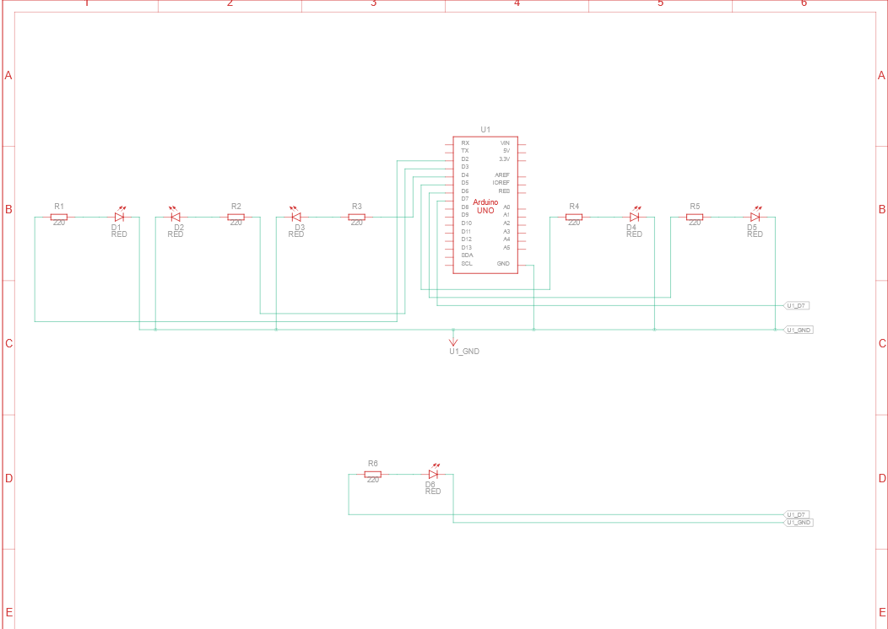

# PERCOBAAN 2A: PERULANGAN (for) - JAWABAN PERTANYAAN PRAKTIKUM 1.6.4
## Modul Praktikum Sistem Tertanam dan Mikrokontroler - Universitas Jenderal Soedirman

---

## 📋 Daftar Isi
1. [Pertanyaan 1: Rangkaian Schematic](#pertanyaan-1-gambarkan-rangkaian-schematic-5-led-running)
2. [Pertanyaan 2: Program Membuat LED Berjalan Kiri ke Kanan](#pertanyaan-2-jelaskan-bagaimana-program-membuat-efek-led-berjalan-dari-kiri-ke-kanan)
3. [Pertanyaan 3: Program LED Kembali Kanan ke Kiri](#pertanyaan-3-jelaskan-bagaimana-program-membuat-led-kembali-dari-kanan-ke-kiri)
4. [Pertanyaan 4: Modifikasi Program + Penjelasan Kode](#pertanyaan-4-program-agar-led-menyala-3-kanan-dan-3-kiri-bergantian)

---

## PERTANYAAN 1: Gambarkan Rangkaian Schematic 5 LED Running

### Jawaban:

Schematics.png
  

  

### Penjelasan Rangkaian:

1. **Sumber Arus**: Arduino Uno pin digital 2-7
2. **Resistor**: Setiap LED dilindungi oleh resistor 220Ω (untuk membatasi arus dan melindungi LED)
3. **LED**: 6 buah LED yang dihubungkan secara paralel
4. **Ground**: Semua LED terhubung ke ground (GND) Arduino

**Fungsi Rangkaian**:
- Ketika pin digital HIGH (5V) → arus mengalir → LED menyala
- Ketika pin digital LOW (0V) → tidak ada arus → LED mati

---

## PERTANYAAN 2: Jelaskan Bagaimana Program Membuat Efek LED Berjalan dari Kiri ke Kanan

### Jawaban:

#### **Kode Original dari Modul:**
```cpp
void loop() {
  // looping dari pin rendah ke tinggi
  for (int ledPin = 2; ledPin < 8; ledPin++) {
    digitalWrite(ledPin, HIGH);     // Hidupkan LED
    delay(timer);                   // Tunggu
    digitalWrite(ledPin, LOW);      // Matikan LED
  }
  // ... (akan dilanjutkan dengan looping kanan ke kiri)
}
```

#### **Penjelasan Baris per Baris:**

```cpp
for (int ledPin = 2; ledPin < 8; ledPin++) {
```

```cpp
  digitalWrite(ledPin, HIGH);
```
- Kirimkan tegangan HIGH (5V) ke pin yang disimpan dalam variabel `ledPin`
- **Efek**: LED pada pin tersebut **MENYALA**

```cpp
  delay(timer);
```
- Tunda program selama `timer` milidetik (dalam kode, `timer = 100`)
- **Efek**: LED tetap menyala selama 100ms

```cpp
  digitalWrite(ledPin, LOW);
```
- Kirimkan tegangan LOW (0V) ke pin `ledPin`
- **Efek**: LED pada pin tersebut **MATI**

```cpp
}
```
- Penutup blok for loop

#### **Alur Eksekusi (Iterasi per Iterasi):**

```
ITERASI 1:
├─ ledPin = 2
├─ Cek: 2 < 8? YA ✓
├─ digitalWrite(2, HIGH)   → LED 1 menyala
├─ delay(100)              → LED 1 tetap ON selama 100ms
├─ digitalWrite(2, LOW)    → LED 1 mati
└─ ledPin++ (ledPin menjadi 3)

ITERASI 2:
├─ ledPin = 3
├─ Cek: 3 < 8? YA ✓
├─ digitalWrite(3, HIGH)   → LED 2 menyala
├─ delay(100)              → LED 2 tetap ON selama 100ms
├─ digitalWrite(3, LOW)    → LED 2 mati
└─ ledPin++ (ledPin menjadi 4)

ITERASI 3:
├─ ledPin = 4
├─ Cek: 4 < 8? YA ✓
├─ digitalWrite(4, HIGH)   → LED 3 menyala
├─ delay(100)
├─ digitalWrite(4, LOW)    → LED 3 mati
└─ ledPin++ (ledPin menjadi 5)

...dan seterusnya sampai...

ITERASI 6:
├─ ledPin = 7
├─ Cek: 7 < 8? YA ✓
├─ digitalWrite(7, HIGH)   → LED 6 menyala
├─ delay(100)
├─ digitalWrite(7, LOW)    → LED 6 mati
└─ ledPin++ (ledPin menjadi 8)

ITERASI 7 (cek kondisi):
├─ ledPin = 8
├─ Cek: 8 < 8? TIDAK ✗
└─ Keluar dari for loop
```


## PERTANYAAN 3: Jelaskan Bagaimana Program Membuat LED Kembali dari Kanan ke Kiri

### Jawaban:

#### **Kode Original dari Modul:**
```cpp
void loop() {
  // ... (bagian kiri ke kanan sudah dijelaskan)
  
  // looping dari pin yang tinggi ke yang rendah
  for (int ledPin = 7; ledPin >= 2; ledPin--) {
    digitalWrite(ledPin, HIGH);
    delay(timer);
    digitalWrite(ledPin, LOW);
  }
}
```

#### **Penjelasan Perbedaan dengan Loop Pertama:**

| Aspek | Kiri → Kanan | Kanan → Kiri |
|-------|--------------|-------------|
| **Inisialisasi** | `ledPin = 2` | `ledPin = 7` |
| **Kondisi** | `ledPin < 8` | `ledPin >= 2` |
| **Increment** | `ledPin++` (tambah) | `ledPin--` (kurangi) |
| **Arah Iterasi** | Menaik: 2,3,4,5,6,7 | Menurun: 7,6,5,4,3,2 |
| **Hasil** | LED menyala dari kiri ke kanan | LED menyala dari kanan ke kiri |

#### **Penjelasan Baris per Baris:**

```cpp
for (int ledPin = 7; ledPin >= 2; ledPin--) {
```

| Bagian | Penjelasan |
|--------|-----------|
| `int ledPin = 7` | **Inisialisasi**: Mulai dari pin 7 (LED paling kanan) |
| `ledPin >= 2` | **Kondisi**: Ulangi selama `ledPin` lebih besar ATAU sama dengan 2 |
| `ledPin--` | **Decrement**: Kurangi nilai `ledPin` sebesar 1 setiap loop |

**Simbol `--` berarti "decrement" atau "kurangi 1"**

#### **Alur Eksekusi (Iterasi per Iterasi):**

```
ITERASI 1:
├─ ledPin = 7
├─ Cek: 7 >= 2? YA ✓
├─ digitalWrite(7, HIGH)   → LED 6 menyala
├─ delay(100)
├─ digitalWrite(7, LOW)    → LED 6 mati
└─ ledPin-- (ledPin menjadi 6)

ITERASI 2:
├─ ledPin = 6
├─ Cek: 6 >= 2? YA ✓
├─ digitalWrite(6, HIGH)   → LED 5 menyala
├─ delay(100)
├─ digitalWrite(6, LOW)    → LED 5 mati
└─ ledPin-- (ledPin menjadi 5)

ITERASI 3:
├─ ledPin = 5
├─ Cek: 5 >= 2? YA ✓
├─ digitalWrite(5, HIGH)   → LED 4 menyala
├─ delay(100)
├─ digitalWrite(5, LOW)    → LED 4 mati
└─ ledPin-- (ledPin menjadi 4)

...dan seterusnya sampai...

ITERASI 6:
├─ ledPin = 2
├─ Cek: 2 >= 2? YA ✓
├─ digitalWrite(2, HIGH)   → LED 1 menyala
├─ delay(100)
├─ digitalWrite(2, LOW)    → LED 1 mati
└─ ledPin-- (ledPin menjadi 1)

ITERASI 7 (cek kondisi):
├─ ledPin = 1
├─ Cek: 1 >= 2? TIDAK ✗
└─ Keluar dari for loop
```

#### **Perbedaan Operator Loop:**

```cpp
// LOOP NAIK (Kiri → Kanan)
for (int i = 0; i < 5; i++)      // i: 0,1,2,3,4

// LOOP TURUN (Kanan → Kiri)
for (int i = 4; i >= 0; i--)     // i: 4,3,2,1,0
```

---

## PERTANYAAN 4: Program Agar LED Menyala 3 Kanan dan 3 Kiri Bergantian

### Jawaban:

#### **Program Arduino (Penuh):**

```cpp

int timer = 100;  // Delay 100ms untuk setiap LED

void setup() {
  // Inisialisasi semua pin LED (2-7) sebagai OUTPUT
  for (int ledPin = 2; ledPin < 8; ledPin++) {
    pinMode(ledPin, OUTPUT);
  }
}

void loop() {
  for (int ledPin = 5; ledPin < 8; ledPin++) {
    digitalWrite(ledPin, HIGH);  // Nyalakan LED kanan
  }
  delay(1000);                    // Tetap ON selama 1 detik
  
  // Matikan semua LED kanan
  for (int ledPin = 5; ledPin < 8; ledPin++) {
    digitalWrite(ledPin, LOW);    // Matikan LED kanan
  }
  delay(500);                     
  
  for (int ledPin = 2; ledPin < 5; ledPin++) {
    digitalWrite(ledPin, HIGH);   // Nyalakan LED kiri
  }
  delay(1000);                    // Tetap ON selama 1 detik
  
  // Matikan semua LED kiri
  for (int ledPin = 2; ledPin < 5; ledPin++) {
    digitalWrite(ledPin, LOW);    // Matikan LED kiri
  }
  delay(500);                    
  
  // Loop kembali ke FASE 1 (Berulang terus menerus)
}
```

---


# Program Arduino: LED 3 Kanan dan 3 Kiri Bergantian

```cpp
int timer = 100;  // Delay 100ms untuk setiap LED
```
- `int timer`: Variabel integer bernama `timer`
- `= 100`: Inisialisasi dengan nilai 100 (milidetik)
- Fungsi: Menyimpan durasi delay yang dapat diubah di satu tempat


#### **FASE 1: LED 3 KANAN MENYALA**

```cpp
for (int ledPin = 5; ledPin < 8; ledPin++) {
  digitalWrite(ledPin, HIGH);
}
```

##### Penjelasan Baris per Baris:

**Baris 1: For Loop**
```cpp
for (int ledPin = 5; ledPin < 8; ledPin++) {
```

| Bagian | Penjelasan |
|--------|-----------|
| `int ledPin = 5` | Mulai dari pin 5 (LED ke-4 dari kiri, pin paling kiri dari "3 kanan") |
| `ledPin < 8` | Ulangi selama pin kurang dari 8 (jadi: 5, 6, 7) |
| `ledPin++` | Tambah 1 setiap iterasi |

**Iterasi yang terjadi:**
- Iterasi 1: ledPin = 5
- Iterasi 2: ledPin = 6
- Iterasi 3: ledPin = 7
- Iterasi 4: Cek 8 < 8? Tidak → Keluar loop

**Baris 2: digitalWrite**
```cpp
  digitalWrite(ledPin, HIGH);
```

| Bagian | Penjelasan |
|--------|-----------|
| `digitalWrite()` | Fungsi Arduino untuk menulis digital value ke pin |
| `ledPin` | Pin yang akan diisi (5, 6, atau 7 tergantung iterasi) |
| `HIGH` | Nilai tegangan tinggi (5V) → **LED MENYALA** |

**Efek:**
- LED 5 menyala (pin 5 → LED 4)
- LED 6 menyala (pin 6 → LED 5)
- LED 7 menyala (pin 7 → LED 6)
- **Semua 3 LED kanan MENYALA BERSAMAAN** ✓

```cpp
delay(1000);
```
- `delay()`: Tunda eksekusi program
- `1000`: Durasi 1000 milidetik = 1 detik
- **Efek**: Semua 3 LED kanan tetap menyala selama 1 detik

**Matikan LED Kanan:**
```cpp
for (int ledPin = 5; ledPin < 8; ledPin++) {
  digitalWrite(ledPin, LOW);
}
```
- Loop yang sama, tapi dengan `LOW` (0V) → **LED MATI**
- Hasil: Pin 5, 6, 7 semua dimatikan

```cpp
delay(500);
```
- Jeda 0.5 detik sebelum masuk FASE 2
- Memberi waktu untuk user melihat perubahan LED

---

#### **FASE 2: LED 3 KIRI MENYALA**

```cpp
for (int ledPin = 2; ledPin < 5; ledPin++) {
  digitalWrite(ledPin, HIGH);
}
```

##### Penjelasan:

**Baris 1: For Loop**
```cpp
for (int ledPin = 2; ledPin < 5; ledPin++) {
```

| Bagian | Penjelasan |
|--------|-----------|
| `int ledPin = 2` | Mulai dari pin 2 (pin paling kiri) |
| `ledPin < 5` | Ulangi selama pin kurang dari 5 (jadi: 2, 3, 4) |
| `ledPin++` | Tambah 1 setiap iterasi |

**Iterasi yang terjadi:**
- Iterasi 1: ledPin = 2 → LED 1 menyala
- Iterasi 2: ledPin = 3 → LED 2 menyala
- Iterasi 3: ledPin = 4 → LED 3 menyala
- **Semua 3 LED kiri MENYALA BERSAMAAN** ✓

**Baris 2: digitalWrite**
```cpp
  digitalWrite(ledPin, HIGH);
```
- Sama seperti FASE 1, tapi kali ini pin 2, 3, 4

```cpp
delay(1000);
```
- LED kiri tetap ON selama 1 detik

**Matikan LED Kiri:**
```cpp
for (int ledPin = 2; ledPin < 5; ledPin++) {
  digitalWrite(ledPin, LOW);
}
```
- Matikan pin 2, 3, 4

```cpp
delay(500);
```
- Jeda 0.5 detik sebelum kembali ke FASE 1

---